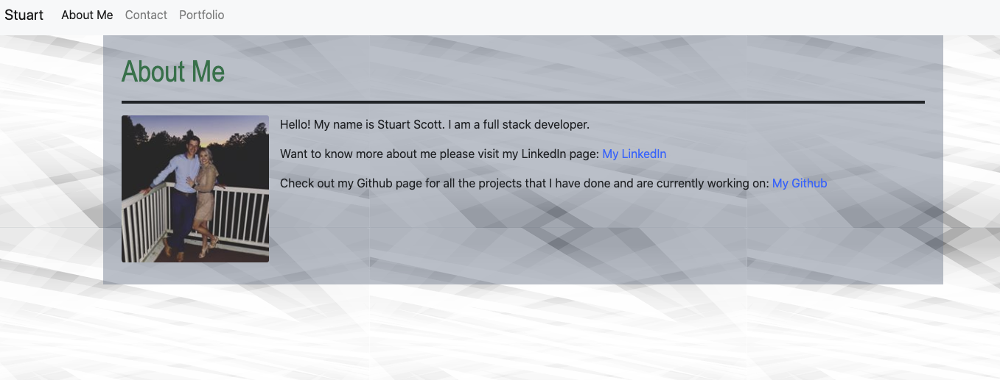

# Bootstrap Portfolio

## Table of Contents

* [Installation](#installation)
* [Usage](#usage)
* [URL](#URL)
* [Credits](#credits)
* [MIT License](#mit_license)

## Installation

1. Clone the repo.
2. Run the index.html file in browser.

## Usage

This Portfolio is hopefully responsive to many different screen size and is able to change when asked to. Hopefully in the future it will be a good jumping block to build upon to make a job presentable portfolio.

## URL

Please use the url below to access my portfolio.

https://yoohooitstoo.github.io/gt-hw-bootstrap-portfolio/

## Credits

This was a solo project completed by Stuart Scott.

## MIT License

Copyright (c) [2020] [Stuart Scott]

Permission is hereby granted, free of charge, to any person obtaining a copy
of this software and associated documentation files (the "Software"), to deal
in the Software without restriction, including without limitation the rights
to use, copy, modify, merge, publish, distribute, sublicense, and/or sell
copies of the Software, and to permit persons to whom the Software is
furnished to do so, subject to the following conditions:

The above copyright notice and this permission notice shall be included in all
copies or substantial portions of the Software.

THE SOFTWARE IS PROVIDED "AS IS", WITHOUT WARRANTY OF ANY KIND, EXPRESS OR
IMPLIED, INCLUDING BUT NOT LIMITED TO THE WARRANTIES OF MERCHANTABILITY,
FITNESS FOR A PARTICULAR PURPOSE AND NONINFRINGEMENT. IN NO EVENT SHALL THE
AUTHORS OR COPYRIGHT HOLDERS BE LIABLE FOR ANY CLAIM, DAMAGES OR OTHER
LIABILITY, WHETHER IN AN ACTION OF CONTRACT, TORT OR OTHERWISE, ARISING FROM,
OUT OF OR IN CONNECTION WITH THE SOFTWARE OR THE USE OR OTHER DEALINGS IN THE
SOFTWARE.
